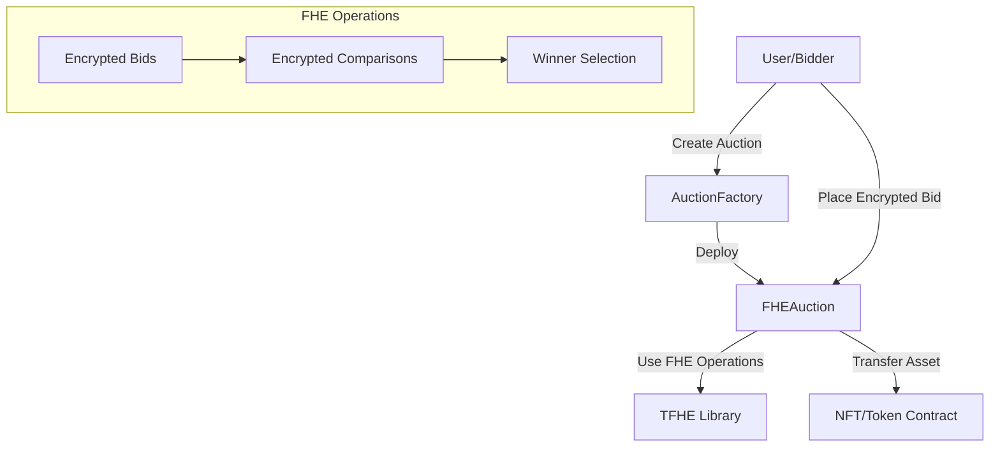

# FHE Sealed-Bid Auction Architecture

## Overview

This project implements a **Fully Homomorphic Encryption (FHE) based sealed-bid auction system** using Zama's FHE protocol. Unlike traditional commit-reveal schemes, bids remain encrypted throughout the auction, with comparisons performed directly on encrypted data.

## Key Innovation: FHE vs Traditional Sealed-Bid

### Traditional Approach (Commit-Reveal)
```
1. Commit Phase: Hash(bid + nonce) → on-chain
2. Reveal Phase: Reveal bid + nonce → verify hash
3. Risk: Front-running during reveal phase
```

### FHE Approach (This Implementation)
```
1. Bid Phase: Encrypt(bid) → on-chain
2. Comparison: Compare encrypted bids directly
3. Benefit: No reveal needed, zero front-running risk
```

## System Architecture



## Contract Architecture

### 1. **AuctionFactory.sol**
- Central deployment and registry contract
- Manages auction creation with validation
- Tracks auctions by seller and asset
- Handles platform fee configuration

**Key Functions:**
- `createAuction()`: Deploy new auction instance
- `getActiveAuctions()`: Query ongoing auctions
- `calculatePlatformFee()`: Fee calculation logic

### 2. **FHEAuction.sol**
- Individual auction instance
- Manages encrypted bids using FHE
- Handles asset custody and transfers
- Implements phase-based auction flow

**Key Functions:**
- `placeBid()`: Submit encrypted bid with deposit
- `finalizeAuction()`: FHE-based winner determination
- `claimRefund()`: Refund for non-winners

### 3. **TFHE Library Integration**
- Uses Zama's FHE types: `euint32`, `ebool`
- Encrypted comparisons: `gt()`, `ge()`, `eq()`
- No decryption needed until winner determination

## Data Flow

### Auction Creation
```
1. Seller → Factory.createAuction(asset, encryptedReserve, timing)
2. Factory → Deploy new FHEAuction contract
3. Factory → Register auction in mappings
4. Seller → Auction.startBidding()
5. Auction → Transfer asset from seller
```

### Bidding Process
```
1. Bidder → Generate encrypted bid offline
2. Bidder → Auction.placeBid(encryptedBid) + deposit
3. Auction → Store euint32 bid amount
4. Auction → Track bidder in array
```

### Winner Selection (FHE Magic ✨)
```solidity
// Pseudo-code of FHE winner selection
euint32 highestBid = bids[0].encryptedAmount;
address winner = bidders[0];

for (each bidder) {
    ebool isHigher = TFHE.gt(bid.amount, highestBid);
    if (TFHE.decrypt(isHigher)) {
        highestBid = bid.amount;
        winner = bidder;
    }
}

// Check reserve price
ebool meetsReserve = TFHE.ge(highestBid, reservePrice);
```

## Security Considerations

### FHE Security Properties
1. **Bid Confidentiality**: Bids remain encrypted on-chain
2. **Comparison Integrity**: FHE ensures correct comparisons
3. **No Information Leakage**: Even gas usage doesn't reveal bid values

### Smart Contract Security
1. **Reentrancy Protection**: Via ReentrancyGuard
2. **Phase Management**: Strict state transitions
3. **Deposit Escrow**: Over-collateralization prevents griefing
4. **Access Control**: Only seller can start/cancel

### Edge Cases Handled
- Auction with no bids
- Reserve price not met
- Failed bid reveals (forfeit deposit)
- Seller cancellation (before bidding)
- Asset transfer failures

## Gas Optimization Strategies

1. **Minimal Storage**: Store only encrypted values
2. **Batch Operations**: Process reveals together
3. **Event-Driven**: Use events for off-chain tracking
4. **Factory Pattern**: Reuse factory logic

## FHE Integration Points

### Current Implementation (Development)
- Mock TFHE library for testing
- Simulated encryption/comparison

### Production Implementation
```solidity
// Real Zama integration
import "@fhevm/lib/TFHE.sol";
import "@fhevm/lib/Gateway.sol";

// Threshold decryption for winner
Gateway.requestDecryption(
    winningBid,
    this.callbackHighestBid.selector,
    0,
    block.timestamp + 100
);
```

## Deployment Architecture

### Local Development
```bash
forge test
forge build
forge script script/Deploy.s.sol --rpc-url local
```

### Zama Devnet Deployment
```bash
forge script script/Deploy.s.sol:DeployZamaScript \
  --rpc-url https://devnet.zama.ai \
  --broadcast \
  --verify
```

### Contract Addresses (Zama Devnet)
- Factory: `[TO BE DEPLOYED]`
- Example Auction: `[CREATED VIA FACTORY]`

## Frontend Integration

### Key Integration Points
1. **Bid Encryption**: Use fhevmjs library
```javascript
import { initFhevm, createInstance } from "fhevmjs";
const instance = await createInstance({ networkUrl: "https://devnet.zama.ai" });
const encryptedBid = await instance.encrypt32(bidAmount);
```

2. **Contract Interaction**: Via ethers.js/viem
```javascript
const auction = new ethers.Contract(auctionAddress, FHEAuctionABI, signer);
await auction.placeBid(encryptedBid, { value: depositAmount });
```

3. **Event Monitoring**: Track auction phases
```javascript
auction.on("BidPlaced", (bidder, deposit) => {
  updateUI({ bidder, deposit });
});
```

## Testing Strategy

### Unit Tests
- Auction lifecycle tests
- FHE operation mocks
- Edge case handling

### Integration Tests
- Factory deployment
- Multi-auction scenarios
- Gas usage benchmarks

### FHE-Specific Tests
- Encrypted bid comparisons
- Reserve price checks
- Winner selection accuracy

## Future Enhancements

1. **Multi-Asset Auctions**: Bundle multiple NFTs
2. **Threshold Decryption**: Distributed key management
3. **Cross-Chain Auctions**: Via bridge integration
4. **Advanced Bid Types**: Proxy bidding, auto-increment
5. **Privacy-Preserving Analytics**: FHE-based statistics

## Conclusion

This architecture leverages FHE to create a truly private auction system where:
- Bids are never revealed (even to the contract)
- No MEV or front-running possible
- Fair price discovery maintained
- Gas-efficient implementation

The use of Zama's FHE protocol represents a paradigm shift in how we think about on-chain auctions and privacy.
