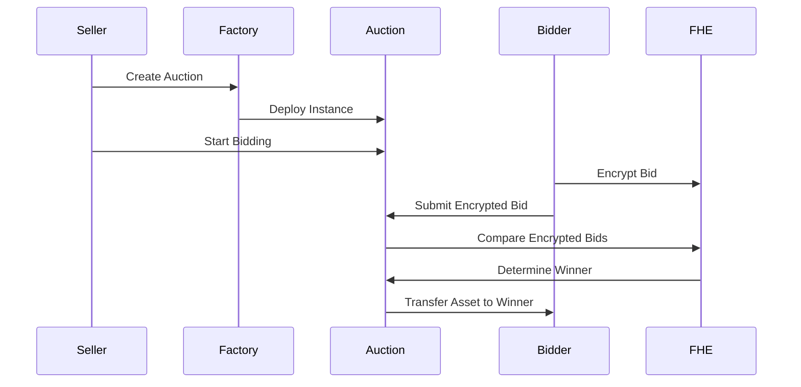

# 🔐 FHE Sealed-Bid Auction Platform

A revolutionary sealed-bid auction system using **Fully Homomorphic Encryption (FHE)** powered by Zama's protocol. Bids remain encrypted on-chain, eliminating front-running and ensuring true price discovery.

## 🌟 Key Features

- **🔒 Always Encrypted**: Bids stay encrypted throughout the auction
- **⚡ No Reveal Phase**: Winners determined via FHE comparisons
- **🛡️ MEV Resistant**: No front-running or bid sniping possible
- **📊 Fair Price Discovery**: Sealed-bid mechanics ensure true valuations
- **🏭 Factory Pattern**: Easy deployment of multiple auctions
- **💎 Multi-Asset Support**: NFTs (ERC-721/1155) and tokens (ERC-20)

## 🚀 Quick Start

### Prerequisites

- [Foundry](https://getfoundry.sh/) installed
- Node.js 18+ (for frontend)
- Git

### Installation

```bash
# Clone the repository
git clone <your-repo>
cd zama/contract

# Install dependencies (when Forge is available)
forge install

# Run tests
forge test

# Build contracts
forge build
```

### Deploy to Zama Devnet

```bash
# Set your private key
export PRIVATE_KEY=your_private_key_here

# Deploy
forge script script/Deploy.s.sol:DeployZamaScript --rpc-url https://devnet.zama.ai --broadcast
```

## 📋 Contract Overview

### Core Contracts

1. **`AuctionFactory.sol`**
   - Deploys and manages auction instances
   - Maintains auction registry
   - Configurable platform fees

2. **`FHEAuction.sol`**
   - Individual auction logic
   - FHE bid management
   - Phase-based flow (Create → Bid → Reveal → Finalize)

### How It Works



## 🧪 Testing

```bash
# Run all tests
forge test

# Run specific test
forge test --match-test testFullAuctionFlow

# Gas reports
forge test --gas-report
```

### Test Coverage

- ✅ Auction creation and initialization
- ✅ Encrypted bid placement
- ✅ FHE winner selection
- ✅ Reserve price enforcement
- ✅ Refund mechanisms
- ✅ Edge cases and security

## 🏗️ Architecture

See [ARCHITECTURE.md](./ARCHITECTURE.md) for detailed system design.

### Key Components

- **FHE Types**: `euint32` for encrypted amounts, `ebool` for comparisons
- **Phase Management**: Enforces auction timeline
- **Asset Custody**: Secure escrow during auction
- **Factory Registry**: Track all auctions

## 🔧 Configuration

### Foundry Settings (`foundry.toml`)

```toml
[profile.default]
solc = "0.8.24"
optimizer = true
optimizer_runs = 200
ffi = true  # Required for FHE operations
```

### Environment Variables

```bash
PRIVATE_KEY=        # Deployer private key
RPC_URL=           # Network RPC endpoint
ETHERSCAN_API_KEY= # For verification
```

## 📱 Frontend Integration

```javascript
// Using fhevmjs
import { createInstance } from "fhevmjs";

const fhevm = await createInstance({ 
  networkUrl: "https://devnet.zama.ai" 
});

// Encrypt bid
const encryptedBid = await fhevm.encrypt32(parseEther("1.5"));

// Submit to contract
await auction.placeBid(encryptedBid, { 
  value: parseEther("2") // deposit
});
```

## 🚨 Security Considerations

- Bids require deposits ≥ bid amount
- Reentrancy protection on all external calls
- Strict phase transitions
- Emergency seller controls (pre-bidding only)

## 📈 Gas Optimization

- Minimal storage usage
- Efficient FHE operations
- Event-based tracking
- Factory pattern for code reuse

## 🛣️ Roadmap

- [ ] Mainnet deployment
- [ ] Advanced bid types (proxy bidding)
- [ ] Cross-chain support
- [ ] Threshold decryption integration
- [ ] DAO governance for platform fees

## 📚 Resources

- [Zama Documentation](https://docs.zama.ai/)
- [FHE Solidity Guide](https://docs.zama.ai/fhevm)
- [OpenZeppelin Contracts](https://docs.openzeppelin.com/)

## 🤝 Contributing

1. Fork the repository
2. Create your feature branch (`git checkout -b feature/amazing-feature`)
3. Commit changes (`git commit -m 'Add amazing feature'`)
4. Push to branch (`git push origin feature/amazing-feature`)
5. Open a Pull Request

## 📄 License

MIT License - see LICENSE file for details

## 🙏 Acknowledgments

- Zama team for FHE protocol
- OpenZeppelin for security patterns
- Foundry for development framework

---

Built with ❤️ using Zama's FHE technology