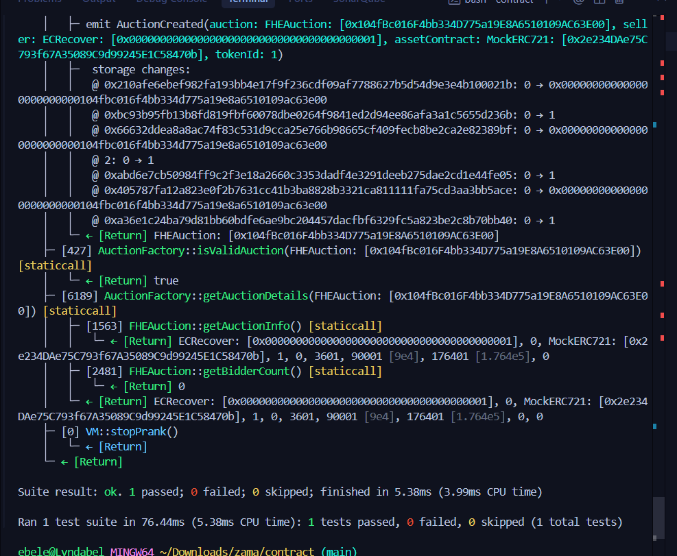

# 🚀 FHE Auction dApp


A **sealed-bid auction dApp** built with **Next.js frontend** and **Solidity smart contracts**, featuring **Fully Homomorphic Encryption (FHE)** confidentiality using **Zama's Protocol**.

## 🎯 Project Overview

This dApp enables users to create and participate in sealed-bid auctions where bids remain confidential until the reveal phase, thanks to FHE technology. The system ensures complete privacy during bidding while maintaining transparency and fairness.

## 🏗️ Architecture

```
├── contract/                 # Solidity smart contracts
│   ├── src/
│   │   ├── FHEAuction.sol   # Main auction contract
│   │   ├── AuctionFactory.sol # Factory for creating auctions
│   │   └── FHE.sol          # FHE library (mock for development)
│   ├── script/               # Deployment scripts
│   ├── test/                 # Contract tests
│   └── foundry.toml         # Foundry configuration
├── frontend/                 # Next.js frontend
│   ├── app/                  # Next.js 14 app router
│   ├── components/           # React components
│   └── package.json         # Frontend dependencies
└── README.md                 # This file
```

## 🚀 Quick Start

### Prerequisites

- **Foundry** (for smart contracts)
- **Node.js 18+** (for frontend)
- **Git Bash** (on Windows)

### 1. Smart Contracts

```bash
cd contract

# Install dependencies
forge install

# Build contracts
forge build

# Run tests
forge test

# Deploy to Lisk Sepolia
export PRIVATE_KEY=your_private_key_here
./deploy.sh
```

### 2. Frontend

```bash
cd frontend

# Install dependencies
npm install

# Set environment variables
cp .env.example .env.local
# Edit .env.local with your contract addresses

# Start development server
npm run dev
```

## 🔐 Smart Contracts

### FHEAuction.sol
- **Sealed-bid auction logic**
- **FHE integration** for encrypted bid processing
- **Multi-phase system**: Setup → Bidding → Reveal → Finalization
- **Support for ERC721, ERC20, and ERC1155 assets**

### AuctionFactory.sol
- **Factory pattern** for creating new auctions
- **Platform fee management**
- **Auction registry and discovery**

### FHE.sol
- **Mock FHE library** for development
- **Encrypted data types**: `euint32`, `ebool`
- **Basic FHE operations**: encryption, decryption, comparisons

## 🎨 Frontend Features

- **🔗 Wallet Connection** with RainbowKit
- **📱 Responsive Design** with Tailwind CSS
- **🎯 Browse Auctions** - View active auctions
- **🚀 Create Auctions** - Deploy new auction contracts
- **📊 Real-time Updates** - Live auction status

## 🛠️ Tech Stack

### Smart Contracts
- **Solidity 0.8.24**
- **Foundry** (Forge, Cast, Anvil)
- **OpenZeppelin Contracts**
- **Zama FHE Protocol**

### Frontend
- **Next.js 14** (App Router)
- **React 18** with TypeScript
- **Tailwind CSS** for styling
- **Wagmi + RainbowKit** for Web3
- **Ethers.js** for blockchain interaction

## 🔒 Security Features

- **FHE Confidentiality** - Bids remain encrypted during bidding
- **Commit-Reveal Scheme** - Prevents front-running
- **Access Control** - Only authorized users can perform actions
- **Reentrancy Protection** - Secure against common attacks
- **Input Validation** - Comprehensive parameter checking

## 📋 Development Status

### ✅ Completed
- [x] Smart contract architecture
- [x] FHE integration (mock)
- [x] Basic auction logic
- [x] Frontend UI components
- [x] Wallet integration
- [x] Deployment scripts

### 🚧 In Progress
- [ ] Contract testing and debugging
- [ ] FHE library integration
- [ ] Frontend-contract connection

### 📋 Next Steps
- [ ] Deploy to Zama devnet
- [ ] Test FHE functionality
- [ ] Frontend integration
- [ ] User testing and feedback

## 🧪 Testing

```bash
cd contract

# Run all tests
forge test

# Run specific test
forge test --match-test testCreateAuction

# Run with verbose output
forge test -vvv
```

## 📈 Coverage

Temporary badge above shows coverage as "unknown". To generate coverage and update the badge:

```bash
cd contract
forge coverage --report summary
```

This prints a summary with total coverage percentage. Replace the badge URL at the top with your actual number, e.g. for 87%:

```markdown

```

Optional: generate lcov and HTML report

```bash
forge coverage --report lcov
# If you have lcov/genhtml installed:
genhtml -o coverage-html lcov.info
```

You can commit a screenshot from `coverage-html` if you prefer an image instead of a badge.

### Coverage Screenshot



## 🚀 Deployment

### Smart Contracts
```bash
# Deploy to Lisk Sepolia
./deploy.sh

# Or manually
forge script script/DeployLiskScript.s.sol:DeployLiskScript \
  --rpc-url https://rpc.sepolia-api.lisk.com \
  --broadcast \
  --verify
```

### Frontend
```bash
cd frontend

# Build for production
npm run build

# Deploy to Vercel
npm install -g vercel
vercel
```

## 🔧 Configuration

### Environment Variables
```bash
# Smart Contracts
PRIVATE_KEY=your_deployment_key

# Frontend
NEXT_PUBLIC_LISK_SEPOLIA_RPC_URL=https://rpc.sepolia-api.lisk.com
NEXT_PUBLIC_FACTORY_ADDRESS=deployed_factory_address
```

### Foundry Configuration
```toml
# foundry.toml
[profile.default]
src = "src"
out = "out"
libs = ["lib"]
solc_version = "0.8.24"
via_ir = true
```

## 🤝 Contributing

1. Fork the repository
2. Create a feature branch
3. Make your changes
4. Add tests for new functionality
5. Submit a pull request

## 📄 License

This project is licensed under the MIT License - see the [LICENSE](LICENSE) file for details.

## 🆘 Support

- **Documentation**: Check the docs folder
- **Issues**: Open a GitHub issue
- **Discussions**: Use GitHub Discussions

## 🙏 Acknowledgments

- **Zama Team** for FHE technology
- **OpenZeppelin** for secure contract libraries
- **Foundry Team** for the development toolkit
- **RainbowKit** for wallet integration

---

**⚠️ Note**: This is a development version. The FHE library is currently mocked and should be replaced with the official Zama FHE implementation before production use. 

export PRIVATE_KEY=your_private_key_here
./deploy.sh